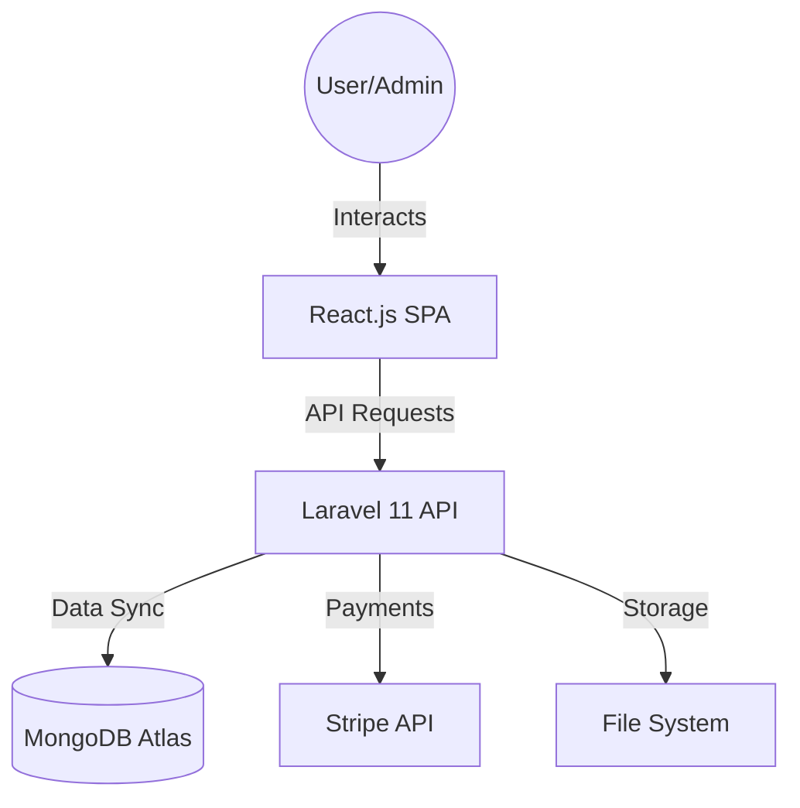
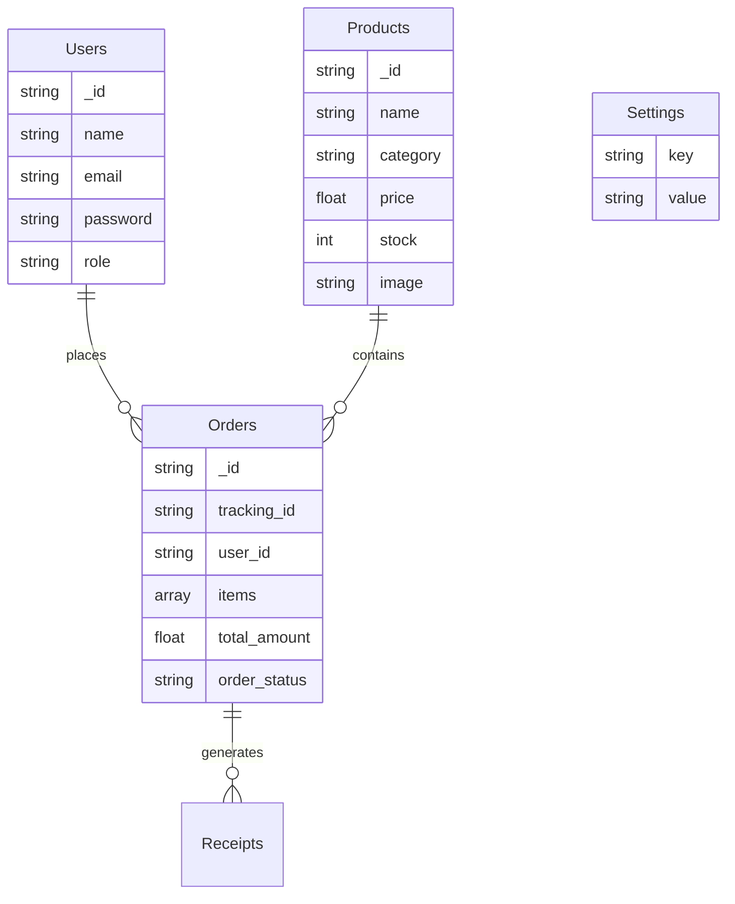
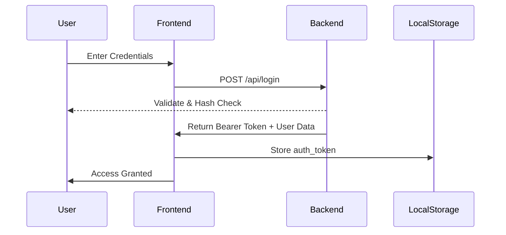
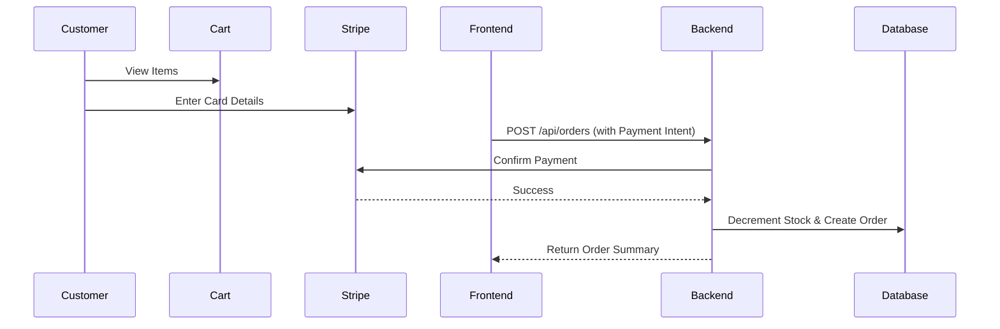
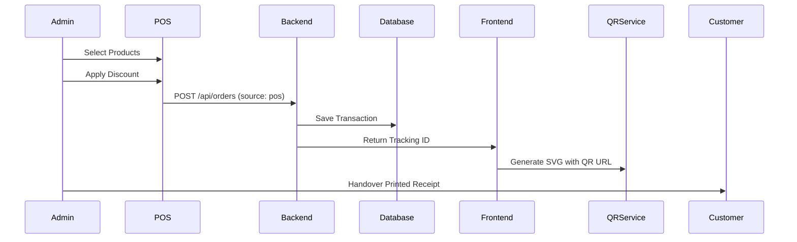

# 🛒 EcomStack - Full-Stack E-Commerce & POS System

A high-performance, premium, and modern e-commerce platform with an integrated Point of Sale (POS) system. Built with **Laravel (PHP)**, **React.js**, and **MongoDB**.

🔗 **Live Links**
- **Full Project (Vercel)**: [ecom-stack-five.vercel.app](https://ecom-stack-five.vercel.app/)
- **Backend API (Render)**: [ecomstack.onrender.com](https://ecomstack.onrender.com)

---

## 📖 Table of Contents
- [Project Overview](#-project-overview)
- [Key Features](#-key-features)
- [System Architecture](#-system-architecture)
- [Role-Based Access Control](#-role-based-access-control-rbac)
- [Tech Stack](#-tech-stack)
- [Database Schema](#-database-schema)
- [Core Workflows](#-core-workflows)
- [Getting Started](#-getting-started)
- [Project Structure](#-project-structure)
- [Future Enhancements](#-future-enhancements)

---

## 🌟 Project Overview
**EcomStack** is a comprehensive solution designed for modern digital commerce. It bridges the gap between online shopping and physical store management by providing a seamless flow from customer browsing to admin-led POS transactions. The project features a premium UI with custom animations and a robust MongoDB-powered backend.

---

## 🚀 Key Features
- **Premium UI/UX**: Custom glassmorphism design with smooth CSS animations (Fade, Scale, Slide).
- **Integrated POS System**: Advanced Point of Sale interface for walk-in customers with instant receipt generation.
- **Manual Order Entry**: Ability for admins to create orders for social media or phone-based sales.
- **Secure Payments**: Full Stripe integration for secure, real-world credit card processing.
- **Universal QR Receipts**: Dynamic QR code generation on all receipts (Online, Manual, and POS).
- **Admin Dashboard**: Real-time management of products, categories, orders, and site-wide settings.
- **Dynamic SEO**: Built-in keyword optimization and meta-data management for search engines.
- **Robust Auth**: Secure authentication with persistent Bearer tokens for cross-domain stability.

---

## 🧠 System Architecture



---

## 👥 Role-Based Access Control (RBAC)
| Feature | Guest | Customer | Admin | Super Admin |
| :--- | :---: | :---: | :---: | :---: |
| Browse Products | ✅ | ✅ | ✅ | ✅ |
| Manage Cart/Wishlist | ❌ | ✅ | ✅ | ✅ |
| Checkout (Stripe) | ❌ | ✅ | ✅ | ✅ |
| POS / Manual Orders | ❌ | ❌ | ✅ | ✅ |
| Update Site Settings | ❌ | ❌ | ✅ | ✅ |
| Manage Admins | ❌ | ❌ | ❌ | ✅ |

---

## 🛠️ Tech Stack
### **Frontend**
- **Framework**: React.js (Vite)
- **Styling**: Vanilla CSS (Premium Custom Design System)
- **State**: Context API (Auth, Cart, Theme)
- **HTTP Client**: Axios (Cross-domain Auth configured)
- **Animations**: CSS Keyframes & Micro-interactions

### **Backend**
- **Framework**: Laravel 11.x
- **Database**: MongoDB Atlas
- **Security**: Laravel Sanctum (Bearer Token Auth)
- **Payment**: Stripe SDK
- **Environment**: PHP 8.2+

---

## 🗄️ Database Schema



---

## 🔄 Core Workflows

### 1. Authentication Process


### 2. Product Checkout (Stripe)


### 3. QR Receipt Generation (POS)


---

## 🛠️ Getting Started
### **Prerequisites**
- PHP 8.2+ & Composer
- Node.js (v18+)
- MongoDB Atlas Account

### **Backend Setup**
1. Navigate to the backend folder: `cd backend`
2. Install dependencies: `composer install`
3. Configure `.env`: Set `DB_CONNECTION=mongodb`, `DB_URI`, `STRIPE_SECRET_KEY`, and `APP_KEY`.
4. Run: `php artisan serve`

### **Frontend Setup**
1. Navigate to the frontend folder: `cd frontend`
2. Install: `npm install`
3. Create `.env`: `VITE_API_URL=http://localhost:8000/api`
4. Start: `npm run dev`

---

## 📁 Project Structure
```text
EcomStack/
├── backend/                   # Laravel API
│   ├── app/Controllers/       # Auth, Product, Order, POS, Settings
│   ├── app/Models/            # MongoDB Eloquent Models
│   ├── config/                # App & CORS Configuration
│   └── routes/api.php         # REST API Endpoints
├── frontend/                  # React Application
│   ├── src/components/        # Navbar, ProductCards, Receipts
│   ├── src/context/           # Auth, Cart, Theme Management
│   ├── src/pages/             # Admin, Checkout, Home, etc.
│   └── src/api/axios.js       # API Client Communication
└── README.md
```

---
## 📄 License
This project is licensed under the MIT License - see the [LICENSE](LICENSE) file for details.

---
## 👨‍💻 Author
**Md. Abdullah Al Noman Khan**  
*Computer Science & Engineering*  
*IUBAT – International University of Business Agriculture and Technology*

---
© 2026 EcomStack. All rights reserved.
